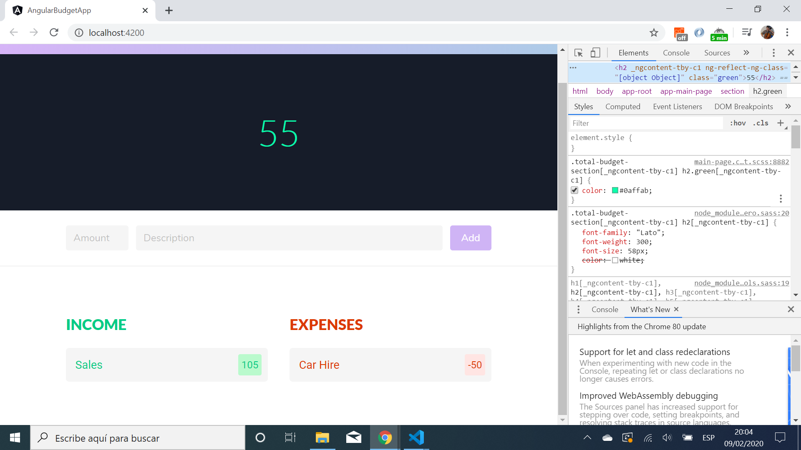
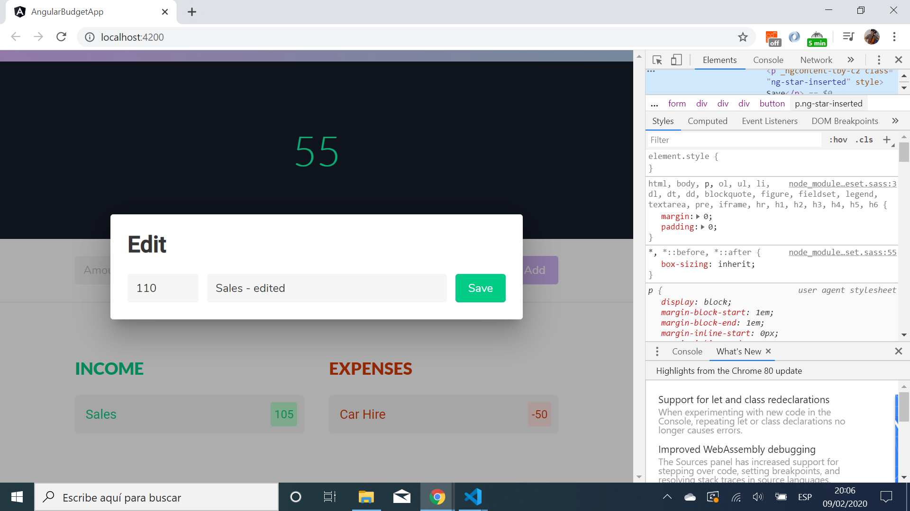

# Angular Budget App - Tutorial Code by Devstackr

* Angular tutorial app to add items to a budget list. 

* Balance shown at top. Inputs section where an item can be added - positive numbers are income and negative numbers are expenses - shown in separate columns.

* Clicking on a budget item opens a modal where the item amount and description can be edited.

* All code by [Devstackr](https://www.youtube.com/channel/UCbwsS1m4Hib6R-9F1alus_A/featured) from Youtube Tutorial [Angular - Build a Budget Calculator Application](https://www.youtube.com/watch?v=sU4z4Ti-8OQ&t=278s).

## Table of contents

* [General info](#general-info)
* [Screenshots](#screenshots)
* [Technologies](#technologies)
* [Setup](#setup)
* [Features](#features)
* [Status](#status)
* [Inspiration](#inspiration)
* [Contact](#contact)

## General info

* Youtube tutorial uses Angular 7. I used Angular 8. [Angular material](https://material.angular.io/) installation is now much easier than as shown in the video.

## Screenshots




## Technologies

* [Angular v8.2.14](https://angular.io/)
* [Angular material v8.2.3](https://material.angular.io/)
* [Bulma v0.8.0](https://bulma.io/documentation/) CSS framework
* [rxjs v6.4.0](https://angular.io/guide/rx-library) reactive programming library

## Setup

* To start the server on _localhost://4200_ type: 'ng serve'

## Code Examples

* Modal created using Angular MatDialog service.

```typescript
onCardClicked(item: BudgetItem) {
  const dialogRef = this.dialog.open(EditItemModalComponent, {
    width: '580px',
    data: item
  });

  dialogRef.afterClosed().subscribe(result => {
    if (result) {
      this.update.emit({
        old: item,
        new: result
      });
    }
  })
}
```

## Features

* [Angular Material Dialog](https://material.angular.io/components/dialog/overview) modal used to edit budget items.

## Status & To-do list

* Status: Completed, tested and fully working.

* To-do: add commenting

## Inspiration

* [Angular - Build a Budget Calculator Application](https://www.youtube.com/watch?v=sU4z4Ti-8OQ&t=278s)
* [Devstackr: Github repo](https://github.com/Devstackr/budget-app-angular)

## Contact

Repo created by [ABateman](https://www.andrewbateman.org) - feel free to contact me!